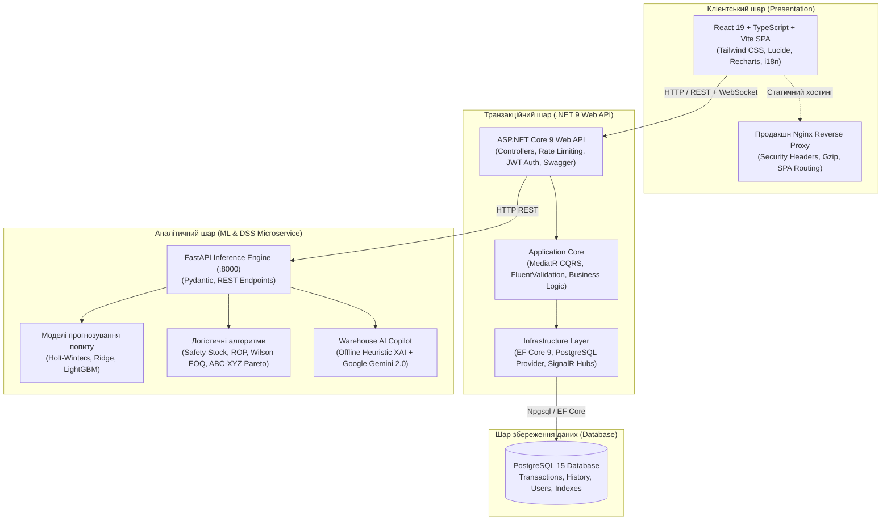

# 📦 Інтелектуальна система складського обліку та оптимізації запасів (Warehouse DSS & Inventory System)

[](https://dotnet.microsoft.com/)
[](https://react.dev/)
[](https://www.typescriptlang.org/)
[](https://www.python.org/)
[](https://fastapi.tiangolo.com/)
[](https://www.postgresql.org/)
[](https://www.docker.com/)
[](https://github.com/)
[](LICENSE)

Сучасний повнофункціональний програмний комплекс для автоматизації складської логістики, управління матеріальними потоками та інтелектуальної підтримки прийняття рішень (DSS — Decision Support System). Система поєднує високонадійний транзакційний бекенд на **.NET 9**, реактивний інтерфейс на **React 19 / TypeScript**, мікросервіс машинного навчання на **Python 3.11 (FastAPI / LightGBM)** та вбудованого **AI-Копілота (Explainable AI / LLM)**.

---

## 📑 Зміст

1. [Архітектура системи](#-архітектура-системи)
2. [Ключові функціональні можливості](#-ключові-функціональні-можливості)
3. [Технологічний стек](#-технологічний-стек)
4. [Структура репозиторію](#-структура-репозиторію)
5. [Швидкий запуск (Docker Compose)](#-швидкий-запуск-docker-compose)
6. [Локальне розгортання для розробки](#-локальне-розгортання-для-розробки)
7. [DevOps, автоматизація та бекапи](#-devops-автоматизація-та-бекапи)
8. [Тестування та якість коду](#-тестування-та-якість-коду)
9. [Автентифікація та облікові записи](#-автентифікація-та-облікові-записи)
10. [API Документація (Swagger)](#-api-документація-swagger)

---

## 🏛 Архітектура системи

Система побудована за принципами чистої мікросервісної та модульної архітектури (**Clean Architecture**, **CQRS** через MediatR, **Inversion of Control**):



---

## 🚀 Ключові функціональні можливості

### 1. Складський облік та управління номенклатурою
* **Каталог товарів:** облік за артикулами (SKU), назвами, категоріями, закупівельними та відпускними цінами, поточними залишками та незнижуваним мінімумом (`MinStock`).
* **Журнал руху матеріальних цінностей:** фіксація операцій приходу (`IN`), відпуску (`OUT`), списання та переміщення з автоматичним збереженням аудиторського сліду.
* **Безпечне завантаження медіа:** валідація MIME-типів, обмеження розміру (до 5 МБ), перевірка розширень (.jpg, .png, .webp) та санітизація імен через GUID.
* **Імпорт / Експорт даних:** швидкий масовий експорт та імпорт каталогу у форматах **Excel (.xlsx)** та **CSV**.

### 2. Генерація та друк штрихкодів і QR-етикеток
* **Апаратна підтримка:** миттєва фільтрація каталогу за скануванням USB/Bluetooth лазерних сканерів штрихкодів.
* **Підтримка форматів:** лінійні штрихкоди **Code 128** та двовимірні **QR-коди** з прямим кодуванням SKU та назви.
* **Гнучкий друк:**
  * Прямий друк на промислові термопринтери (етикетки 58×40 мм, 80×50 мм, 40×25 мм).
  * Пакетна генерація векторних PDF-аркушів для наклейок формату **А4** (jsPDF).
  * Налаштування кількості копій, відображення дати, ціни та завантаження PNG-етикеток.

### 3. Оптимізація запасів — «Радар закупівель» (Procurement Radar)
* **Динамічний страховий запас ($SS$):**
  $$SS = Z \times \sqrt{L \cdot \sigma_D^2 + D_{avg}^2 \cdot \sigma_L^2}$$
  де $Z$ — квантиль рівня сервісу (90%, 95%, 99%), $L$ — логістичне плече поставки, $\sigma_D$ — варіативність добового попиту.
* **Точка перезамовлення ($ROP$):**
  $$ROP = (D_{daily} \times L) + SS$$
* **Економічний розмір замовлення (формула Уілсона, $EOQ$):**
  $$EOQ = \sqrt{\frac{2 \cdot D \cdot S}{H}}$$
* **Аудит дефіциту за 4 статусами:**
  * 🔴 **ТЕРМІНОВО** — нульовий залишок або вичерпання $\le 2$ днів.
  * 🟠 **КРИТИЧНО** — залишок нижче точки $ROP$, час до вичерпання $\le$ терміну поставки.
  * 🟡 **УВАГА** — залишок нижче межі $ROP$.
  * 🟢 **НОРМА** — залишки покривають плановий горизонт.

### 4. Портфельний аналіз асортименту (Матриця 3×3 ABC-XYZ)
* **ABC-аналіз (критерій Парето):** класифікація позицій за накопиченою часткою виручки:
  * **Група A** — формує перші 80% виручки (стратегічні позиції).
  * **Група B** — наступні 15% виручки (середній оборот).
  * **Група C** — останні 5% виручки (низькомаржинальні товари).
* **XYZ-аналіз (стабільність попиту за коефіцієнтом варіації $CV$):**
  * **Клас X** ($CV \le 20\%$) — висока прогнозованість, мінімальні коливання.
  * **Клас Y** ($20\% < CV \le 35\%$) — помірна сезонність.
  * **Клас Z** ($CV > 35\%$) — стохастичний/спорадичний попит.
* **Автоматичний вибір логістичної стратегії:** рекомендація індивідуального сценарію поповнення для кожної з 9 комірок матриці (Just-in-Time, календарне планування, закупівля під замовлення тощо).

### 5. Машинне навчання та прогнозування часових рядів (ML Forecasting)
* Підтримка трьох моделей:
  1. **Holt-Winters Exponential Smoothing** (адитивна сезонність та локальний лінійний тренд).
  2. **Ridge Regression** з генерацією лагових ознак ($t-1, t-2, t-7, t-14$), ковзних середніх (MA7, MA14) та дня тижня.
  3. **LightGBM Regressor** (градієнтний бустінг дерев рішень).
* Автоматичний вибір кращої моделі (`model_type=best`) за мінімізацією помилки **MAPE** на валідаційній вибірці.
* Побудова **95% довірчих інтервалів прогнозу** ($\pm 1.96 \cdot \sigma_{residuals}$).

### 6. Інтелектуальний AI-Копілот складу (Warehouse Copilot)
* **Дводіапазонний режим:**
  * **Офлайн-режим (Explainable AI):** автономний евристичний рушій логістичного аналізу, що працює локально без доступу до Інтернету (гарантія 100% працездатності під час презентацій та захисту).
  * **Онлайн-режим (Cloud LLM):** підключення до **Google Gemini 2.0 Flash** через нативний HTTP REST без сторонніх залежностей.
* **Можливості асистента:**
  * Пояснення логіки надання статусів товарам за формулами $SS, ROP, EOQ$.
  * Генерація офіційного ділового листа постачальнику із зазначенням артикулів, обсягів, цін та реквізитів з можливістю експорту в PDF.
  * Автоматичне виявлення сутності постачальника та товару за природно-мовним текстом (NLP).

### 7. Безпека та оптимізація
* **ASP.NET Core 9 Rate Limiting:** захист від атак підбору паролів (Fixed Window: максимум 10 спроб/хв на IP з відповіддю HTTP 429).
* **Role-Based Access Control (RBAC):** гнучке розмежування прав доступу (Admin, Manager, WarehouseWorker, Viewer).
* **Nginx Hardening:** HTTP-заголовки `X-Frame-Options`, `X-Content-Type-Options`, `Referrer-Policy`, `Permissions-Policy`, приховування версії сервера (`server_tokens off`).
* **База даних:** використання `.AsNoTracking()` та проекцій для запитів читання.

### 8. Повна інтернаціоналізація (i18n)
* Дві підтримувані мови: **Українська (`uk`)** та **Англійська (`en`)**.
* Миттєве перемикання у верхній панелі, збереження вибору користувача у `localStorage`.

---

## 🛠 Технологічний стек

| Шар | Технології та бібліотеки |
| :--- | :--- |
| **Backend API** | C#, .NET 9.0 SDK, ASP.NET Core Web API, MediatR (CQRS), FluentValidation, SignalR |
| **Data Access** | Entity Framework Core 9, Npgsql (PostgreSQL Provider), EF Core InMemory (тести) |
| **Frontend** | React 19, TypeScript 5.7, Vite 7, Tailwind CSS, Lucide Icons, Recharts, Axios |
| **ML & Data Science** | Python 3.11, FastAPI, Pydantic v2, scikit-learn, LightGBM, statsmodels, NumPy, Pandas |
| **Штрихкоди & PDF** | JsBarcode (Code128), QRCode, jsPDF, html2canvas |
| **База даних** | PostgreSQL 15 Alpine, WAL, автоматична міграція схем |
| **DevOps & Контейнеризація**| Docker, Docker Compose, Nginx Alpine, PowerShell Automation, Shell Scripts |
| **CI/CD** | GitHub Actions (4 паралельні джоби: Backend, Frontend, ML Service, Docker) |
| **Тестування** | xUnit, .NET Test SDK, Python unittest, Vite / TypeScript typecheck |

---

## 📂 Структура репозиторію

```text
InventorySystem/
├── .github/workflows/ci.yml       # GitHub Actions CI/CD пайплайн
├── backups/                       # Каталог для резервних копій PostgreSQL (.sql)
├── frontend/                      # React 19 + TypeScript веб-додаток
│   ├── src/
│   │   ├── api/                   # Клієнти взаємодії з .NET API та ML Service
│   │   ├── components/            # UI-компоненти (BarcodeModal, Navbar, Sidebar тощо)
│   │   ├── i18n/                  # Файли перекладів (uk, en)
│   │   ├── pages/                 # Сторінки додатку (Dashboard, Products, Radar, Copilot)
│   │   └── utils/                 # Утиліти експорту PDF, друку штрихкодів
│   ├── nginx.conf                 # Hardened конфігурація для продакшн Nginx
│   └── package.json
├── ml-service/                    # Мікросервіс машинного навчання та аналітики
│   ├── data/                      # Реальний роздрібний датасет UCI Online Retail
│   ├── models/schemas.py          # Pydantic моделі запитів та відповідей
│   ├── services/                  # Алгоритми прогнозування, ABC-XYZ, SS/ROP/EOQ, Копілот
│   ├── tests/                     # 41 автоматизований Python unit-тест
│   ├── Dockerfile
│   ├── main.py                    # Точка входу FastAPI
│   └── requirements.txt
├── scripts/                       # DevOps скрипти автоматизації
│   ├── devops.ps1                 # Майстер-скрипт керування системою
│   ├── backup-db.ps1 / .sh        # Резервне копіювання БД
│   └── restore-db.ps1 / .sh       # Відновлення БД
├── src/                           # Backend на .NET 9
│   ├── Inventory.API/             # Контролери, конфігурація, Program.cs
│   ├── Inventory.Application/     # CQRS команди, запити, DTO, валідатори
│   ├── Inventory.Domain/          # Сутності предметної області (Product, StockMovement)
│   ├── Inventory.Infrastructure/  # EF Core контекст, конфігурація БД, міграції
│   └── Inventory.Tests/           # 23 юніт- та інтеграційні тести xUnit
├── docker-compose.yml             # Конфігурація для розробки (Hot Reload)
├── docker-compose.prod.yml        # Продакшн стек з оптимізованими контейнерами
└── .env.example                   # Зразок конфігураційних змінних оточення
```

---

## ⚡ Швидкий запуск (Docker Compose)

Найпростіший спосіб підняти повну інфраструктуру проєкту зі всіма 4 сервісами:

### Крок 1. Клонуйте репозиторій та підготуйте `.env`
```bash
git clone <URL_РЕПОЗИТОРІЮ>
cd InventorySystem
copy .env.example .env
```

### Крок 2. Запустіть сервіси через Master DevOps Script
У терміналі **PowerShell**:
```powershell
.\scripts\devops.ps1 dev
```
*(Або за допомогою стандартної команди Docker Compose)*:
```bash
docker compose up -d --build
```

### Крок 3. Доступ до компонентів системи
Після успішного старту контейнерів відкрийте у браузері:
* 🌐 **Веб-додаток (Frontend):** [http://localhost](http://localhost) (або [http://localhost:5173](http://localhost:5173))
* 📘 **Swagger .NET Web API:** [http://localhost:8080/swagger](http://localhost:8080/swagger)
* 🧠 **FastAPI ML Service Docs:** [http://localhost:8000/docs](http://localhost:8000/docs)
* 🐘 **PostgreSQL 15:** `localhost:5432` (`DB: inventory_db, User: postgres, Password: password`)

---

## 💻 Локальне розгортання для розробки

Якщо ви бажаєте запустити компоненти системи окремо для розробки та налагодження:

### 1. База даних PostgreSQL
```bash
docker run --name inventory-db -e POSTGRES_USER=postgres -e POSTGRES_PASSWORD=password -e POSTGRES_DB=inventory_db -p 5432:5432 -d postgres:15-alpine
```

### 2. Backend API (.NET 9)
```bash
cd src/Inventory.API
dotnet restore
dotnet run --launch-profile http
```
*(Бекенд запуститься на адресі `http://localhost:8080`)*

### 3. ML Service (Python 3.11)
```bash
cd ml-service
python -m venv .venv
# Windows:
.venv\Scripts\activate
# Linux/macOS:
# source .venv/bin/activate

pip install -r requirements.txt
uvicorn main:app --host 0.0.0.0 --port 8000 --reload
```

### 4. Frontend (React 19)
```bash
cd frontend
npm install --legacy-peer-deps
npm run dev
```
*(Інтерфейс відкриється на `http://localhost:5173`)*

---

## 🛠 DevOps, автоматизація та бекапи

У проєкті реалізовано централізований інструмент автоматизації [scripts/devops.ps1](file:///E:/Coursework/InventorySystem/scripts/devops.ps1):

| Команда | Опис дії |
| :--- | :--- |
| `.\scripts\devops.ps1 dev` | Запуск середовища розробки з Hot Reload для бекенду, фронтенду та ML |
| `.\scripts\devops.ps1 prod` | Збірка та запуск оптимізованого продакшн-середовища |
| `.\scripts\devops.ps1 down` | Коректна зупинка всіх активних контейнерів |
| `.\scripts\devops.ps1 status` | Моніторинг контейнерів та опитування healthcheck ендпоінтів |
| `.\scripts\devops.ps1 test` | Послідовний запуск тестів .NET, тестів ML та збірки фронтенду |
| `.\scripts\devops.ps1 backup` | Створення резервної копії БД PostgreSQL із міткою часу у папку `backups/` |
| `.\scripts\devops.ps1 restore` | Відновлення БД з останнього або обраного дампа |
| `.\scripts\devops.ps1 logs` | Перегляд потокових логів контейнерів у реальному часі |

---

## 🧪 Тестування та якість коду

У репозиторії реалізовано дворівневе комплексне автотестування (**всього 64 тести**):

### 1. Бекенд (.NET 9 / xUnit / EF Core InMemory)
23 автоматизовані тести перевіряють:
* CQRS обробники команд (`CreateProduct`, `UpdateProduct`, `DeleteProduct`, `CreateCategory`, `DeleteCategory`).
* CQRS запити з посторінковою пагінацією, категорійними фільтрами та пошуком за артикулом/назвою.
* Інваріанти складського балансу (прихід, розхід, контроль перевищення) та детекцію дефіциту (`LowStockCondition`).

Запуск тестів бекенду:
```bash
dotnet test InventorySystem.sln --configuration Release
```

### 2. ML-мікросервіс (Python 3.11 / unittest)
41 автоматизований тест перевіряє:
* Точність формул $SS$, $ROP$, $EOQ$ та класифікації критичності залишків.
* Розподіл Парето (A/B/C) та коефіцієнт варіації попиту (X/Y/Z) матриці 3×3.
* Генерацію лагових ознак та тренування моделей прогнозування (Holt-Winters, Ridge, LightGBM).
* Автономний евристичний рушій AI-Копілота (XAI) та генерацію комерційних листів.
* Усі маршрути FastAPI (`/health`, `/api/procurement/radar`, `/api/forecast/{id}`, `/api/analytics/abc-xyz`).

Запуск тестів ML-сервісу:
```bash
docker exec inventory-ml python -m unittest discover tests
# або локально:
cd ml-service && python -m unittest discover tests
```

---

## 🔑 Автентифікація та облікові записи

Система автоматично створює початкового суперкористувача (`Admin`) при первинному запуску міграцій бази даних:

| Параметр | Значення за замовчуванням |
| :--- | :--- |
| **Логін** | `admin` |
| **Пароль** | `Admin123!` |
| **Роль** | `Admin` (повний доступ до розділів «Персонал», налаштувань та списань) |

> 🔒 *Для створення додаткових облікових записів або зміни паролів використовуйте форму реєстрації або розділ «Персонал» у веб-інтерфейсі.*

---

## 📚 API Документація (Swagger)

Обидва бекенд-сервіси мають вбудовану інтерактивну OpenAPI/Swagger документацію:
* **ASP.NET Core Web API:** [http://localhost:8080/swagger](http://localhost:8080/swagger)
  * Авторизація через заголовок `Bearer <JWT_TOKEN>`.
  * Доступ до всіх складських сутностей, звітів та операцій.
* **FastAPI ML & Analytics Service:** [http://localhost:8000/docs](http://localhost:8000/docs)
  * Альтернативна документація ReDoc: [http://localhost:8000/redoc](http://localhost:8000/redoc).
  * Ендпоінти часових рядів, розрахунку замовлень та AI-Копілота.

---

## 📄 Ліцензія

Проєкт розроблено в рамках дипломного/курсового проєкту. Розповсюджується під ліцензією [MIT](LICENSE).
